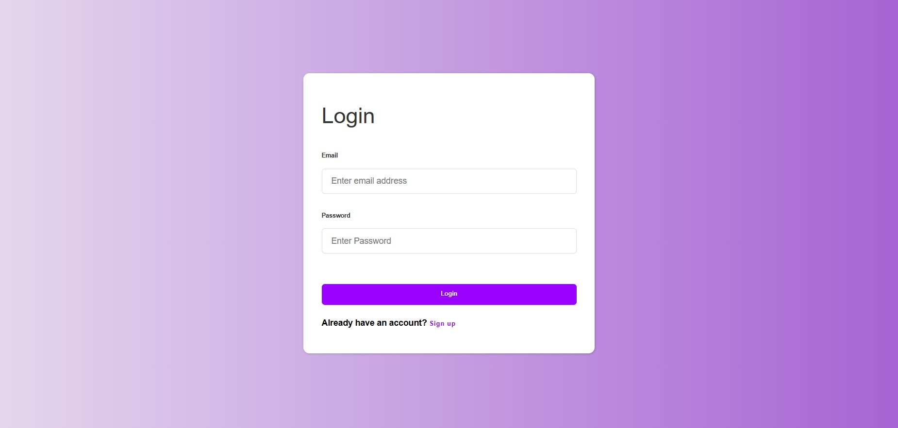
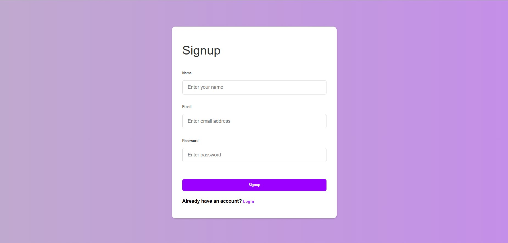
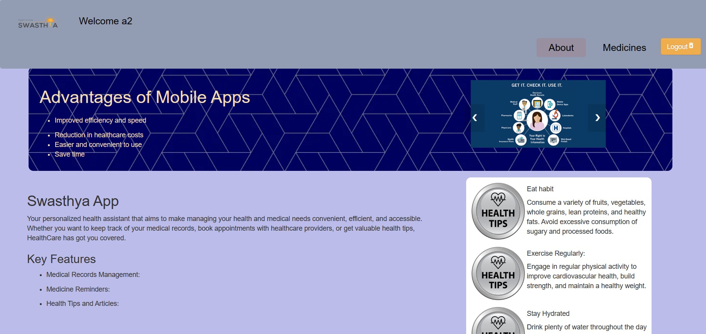
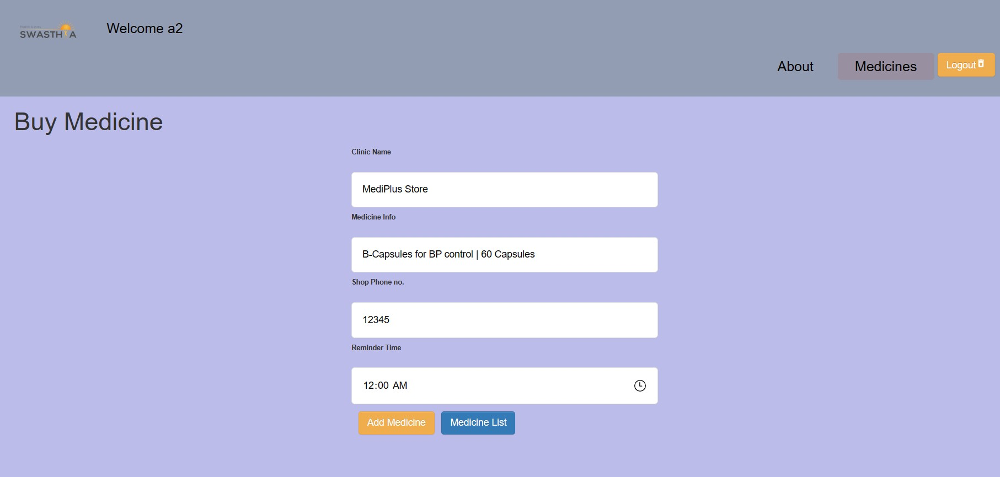
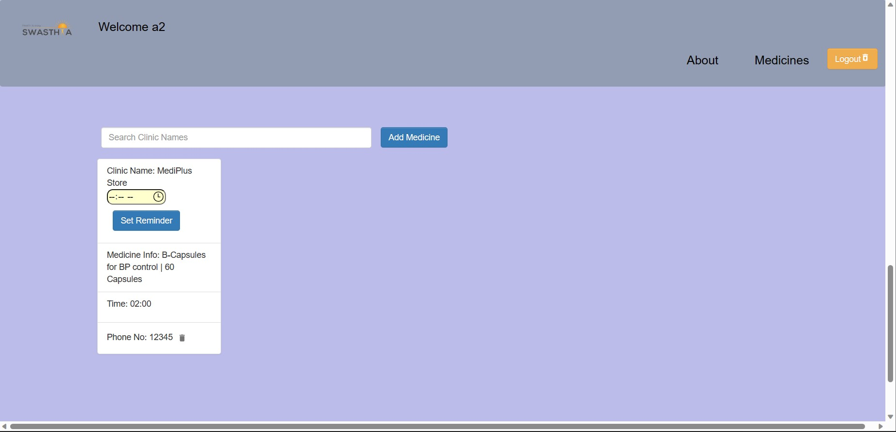

# Swasthya App

Your personalized health assistant that aims to make managing your health and medical needs convenient, efficient, and accessible. Whether you want to keep track of your medical records or get valuable health tips, HealthCare has got you covered.

# Tech Stacks Used -
**React , React-Router DOM , FireBase , FireStore , Bootstrap , Material Ui Core , Lodash ,VS Code Editor**

# Key Features

**1.Authentication System using FireBase Auth**
SignInPage

SignUpPage

# 2.About Section - Details of App 

# 3.Buy Medicine Section - Buy Medicine from Medical with Shop Phone,Time schedule to take medicine and Medicine Information.

# 4.Reminder -Set reminder according to user requirement 

